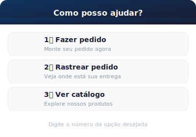
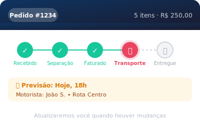
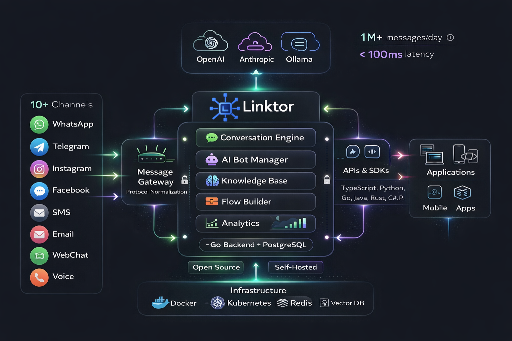

# Linktor

<p align="center">
  
</p>

<p align="center">
  <strong>Plataforma Open-Source de Mensageria Multicanal com Inteligência Artificial</strong>
</p>

<p align="center">
  <em>Powered by msgfy engine</em>
</p>

<p align="center">
  <a href="#sobre">Sobre</a> •
  <a href="#funcionalidades">Funcionalidades</a> •
  <a href="#arquitetura">Arquitetura</a> •
  <a href="#tecnologias">Tecnologias</a> •
  <a href="#instalação">Instalação</a> •
  <a href="#uso">Uso</a> •
  <a href="#api">API</a> •
  <a href="#sdks">SDKs</a> •
  <a href="#mcp-server">MCP</a> •
  <a href="#documentação">Docs</a> •
  <a href="#plugins">Plugins</a> •
  <a href="#testes">Testes</a> •
  <a href="#contribuição">Contribuição</a>
</p>

---

## Sobre

**Linktor** é uma plataforma B2B de mensageria multicanal, open source e extensível via plugins, que unifica a comunicação de empresas com seus clientes através de múltiplos canais em uma única interface. O projeto resolve o problema da fragmentação de canais, permitindo que equipes de atendimento gerenciem conversas de WhatsApp, Telegram, SMS, WebChat, Instagram e Facebook Messenger em um só lugar.

### O Problema

Empresas enfrentam dificuldades ao gerenciar múltiplos canais de comunicação:

- **Fragmentação**: Cada canal tem sua própria interface e API
- **Perda de contexto**: Histórico de conversas espalhado em diferentes sistemas
- **Escalabilidade**: Difícil escalar atendimento humano para demandas crescentes
- **Custos**: Manter integrações separadas é caro e complexo
- **Tempo de resposta**: Clientes esperam respostas instantâneas 24/7

### A Solução

Linktor oferece:

- **Inbox Unificada**: Todas as conversas em uma única interface
- **Bots com IA**: Atendimento automatizado com GPT-4, Claude e modelos locais (Ollama)
- **Knowledge Base**: RAG (Retrieval Augmented Generation) para respostas precisas baseadas em documentos
- **Flow Builder**: Editor visual para criar fluxos conversacionais sem código
- **Escalação Inteligente**: Transição suave de bot para humano quando necessário
- **Analytics**: Métricas de performance, resolução e satisfação
- **Multi-tenant**: Isolamento completo de dados por organização
- **Extensível**: Sistema de plugins para adicionar novos canais

### Branding

```
LINKTOR (linktor.io)
  ├── Plataforma completa
  ├── Documentação oficial
  ├── Cloud hosting (futuro)
  └── Branding corporativo

msgfy (GitHub org: msgfy)
  ├── Core engine open source
  ├── SDKs e bibliotecas
  ├── CLI tools
  └── Community packages
```

---

## Funcionalidades

### Canais Suportados

| Canal | Status | Descrição |
|-------|--------|-----------|
| WhatsApp Business API | ✅ Completo | Integração oficial Meta Cloud API + **Coexistence (SMB)** |
| WhatsApp Unofficial | ✅ Completo | Baileys/WhatsApp Web Multi-device |
| WebChat | ✅ Completo | Widget embeddable para websites |
| Telegram | ✅ Completo | Bot API com suporte a mídia |
| SMS | ✅ Completo | Twilio, Vonage, Plivo |
| Email | ✅ Completo | SMTP, SendGrid, SES, Mailgun, Postmark |
| Instagram DM | ✅ Completo | Meta Graph API |
| Facebook Messenger | ✅ Completo | Meta Graph API |
| RCS | ✅ Completo | Google RCS Business Messaging |
| Voice | ✅ Completo | Twilio Voice, Vonage, Amazon Connect, Asterisk, FreeSWITCH |

### WhatsApp Coexistence (SMB)

O Linktor suporta **WhatsApp Coexistence**, uma feature crítica que permite uso simultâneo do WhatsApp Business App (celular) + Cloud API (plataforma) **no mesmo número de telefone**.

#### Vantagens

- **Onboarding em 5 minutos**: Escaneie o QR code e está conectado, sem migração de número
- **Mantém histórico**: Importa até 6 meses de conversas
- **Híbrido App + API**: Vendedor responde VIPs pelo celular, bot automatiza follow-ups
- **Sincronização bidirecional**: Mensagens enviadas pelo App aparecem no Linktor (via Message Echoes)

#### Features Implementadas

| Feature | Status | Descrição |
|---------|--------|-----------|
| Embedded Signup Flow | ✅ | Conexão via QR code do Facebook SDK |
| OAuth Token Exchange | ✅ | Troca código por access token seguro |
| Detecção Coexistence | ✅ | Verifica se número usa Business App |
| Message Echoes | ✅ | Recebe mensagens enviadas pelo App |
| History Import | ✅ | Importa conversas dos últimos 6 meses |
| Activity Monitoring | ✅ | Monitora regra dos 14 dias |
| Coexistence Status | ✅ | Dashboard com status de sincronização |

#### API Endpoints

```bash
# Iniciar Embedded Signup (OAuth)
POST /api/v1/oauth/whatsapp/embedded-signup/start

# Callback do OAuth
GET /api/v1/oauth/whatsapp/embedded-signup/callback

# Criar canal após OAuth
POST /api/v1/oauth/whatsapp/embedded-signup/create-channel

# Status de Coexistence
GET /api/v1/channels/:id/coexistence-status

# Iniciar importação de histórico
POST /api/v1/channels/:id/import-history

# Progresso da importação
GET /api/v1/channels/:id/import-history/:importId
```

#### Regra dos 14 Dias

O WhatsApp Business App deve ser aberto **pelo menos 1x a cada 14 dias** para manter o Coexistence ativo. O Linktor monitora automaticamente:

- Alerta quando inativo por 10+ dias
- Verifica status quando chega a 14 dias
- Dashboard widget mostra última atividade do App

#### Limitações do Coexistence

Após ativar Coexistence, algumas features do App são desabilitadas:

- ❌ Broadcast Lists (use templates via API)
- ❌ View Once Media
- ❌ WhatsApp for Windows/WearOS
- ✅ WhatsApp Web e Mac funcionam normalmente

### Core Features

#### 1. Inbox Unificada
- Visualização de todas as conversas em tempo real
- Filtros por canal, status, prioridade e agente
- Busca full-text em mensagens
- Atribuição de conversas para agentes
- Indicadores de mensagens não lidas
- WebSocket para atualizações instantâneas

#### 2. Bots com Inteligência Artificial
- **Múltiplos Provedores**: OpenAI (GPT-4o, GPT-4), Anthropic (Claude 4 Opus/Sonnet), Ollama (modelos locais)
- **Configuração por Bot**: Temperatura, max tokens, system prompt personalizado
- **Regras de Escalação**: Por confiança baixa, sentimento negativo, keywords ou intenção
- **Horário de Funcionamento**: Bots ativos apenas em horários configurados
- **Contexto de Conversa**: Mantém histórico para respostas contextualizadas

#### 3. Knowledge Base (RAG)
- **Tipos**: FAQ, Documentos, Website
- **Embeddings**: Busca semântica com pgvector (OpenAI ada-002)
- **Chunking Inteligente**: Divisão automática de documentos longos
- **Similaridade**: Respostas baseadas em conteúdo mais relevante
- **Regeneração**: Atualização de embeddings sob demanda

#### 4. Flow Builder
- **Editor Visual**: Arrastar e soltar nós no canvas
- **Tipos de Nó**:
  - Message: Envia mensagem ao usuário
  - Question: Faz pergunta com quick replies
  - Condition: Bifurcação baseada em condições
  - Action: Executa ações (tags, HTTP calls)
  - End: Finaliza o fluxo
- **Quick Replies**: Botões de resposta rápida
- **Ações**: Tags, atribuição, escalação, chamadas HTTP
- **Triggers**: Por intent detectado, keyword ou manualmente
- **Teste Integrado**: Simule fluxos antes de publicar

#### 5. Analytics Dashboard
- **Métricas Principais**:
  - Total de conversas
  - Taxa de resolução por bot
  - Tempo médio de resposta
  - Confiança média das respostas
- **Gráficos**:
  - Conversas ao longo do tempo (area chart)
  - Motivos de escalação (pie chart)
- **Performance de Fluxos**: Taxa de conclusão por fluxo
- **Por Canal**: Métricas segmentadas por canal
- **Trends**: Comparação com período anterior

#### 6. Multi-tenancy
- Isolamento completo de dados por tenant
- Planos de assinatura (Free, Starter, Professional, Enterprise)
- Limites configuráveis:
  - Máximo de canais
  - Máximo de usuários
  - Máximo de contatos
  - Mensagens por mês

#### 7. Escalação Inteligente
- Detecção automática de necessidade de humano
- Transferência com contexto completo da conversa
- Histórico de interações com o bot
- Análise de sentimento e intenção
- Fila de atendimento por prioridade

#### 8. LVRE - Linktor Visual Response Engine

O **LVRE** (Linktor Visual Response Engine) é um sistema de renderização que converte HTML em imagens otimizadas para canais que não suportam elementos interativos (como botões ou templates estruturados) - como WhatsApp não-oficial, SMS, ou canais legados.

<p align="center">
  
  
</p>

<p align="center">
  
  
</p>

**Características:**

- **Renderização HTML → Imagem**: Usa headless Chrome (chromedp) para renderizar qualquer HTML
- **Templates Predefinidos**: 6 templates otimizados para WhatsApp (menu, produto, status, lista, confirmação, PIX)
- **Custom HTML**: Desenvolvedores podem passar qualquer HTML para renderização
- **Otimização de Imagem**: WebP por padrão (30% menor), compressão PNG via pngquant
- **Multi-canal**: Configurações otimizadas por canal (WhatsApp, Telegram, Web, Email)
- **Cache Redis**: Imagens renderizadas são cacheadas para performance
- **Caption + Follow-up**: Suporte a texto junto com a imagem e mensagem de acompanhamento
- **Multi-tenant**: Branding customizado por tenant (cores, logo, fontes)

**API Endpoints:**

```bash
# Renderizar HTML customizado
POST /api/v1/vre/render
{
  "html": "<div style='padding:20px'>...</div>",
  "channel": "whatsapp",
  "caption": "Texto junto com a imagem",
  "follow_up_text": "Mensagem enviada após a imagem"
}

# Renderizar template predefinido
POST /api/v1/vre/render
{
  "template_id": "menu_opcoes",
  "data": {
    "titulo": "Como posso ajudar?",
    "opcoes": [
      {"label": "Fazer pedido", "icone": "pedido"},
      {"label": "Rastrear pedido", "icone": "entrega"}
    ]
  },
  "channel": "whatsapp"
}

# Listar templates disponíveis
GET /api/v1/vre/templates

# Preview de template
GET /api/v1/vre/templates/:id/preview

# Configurar branding do tenant
PUT /api/v1/vre/config
```

**Templates Disponíveis:**

| Template | Descrição | Uso |
|----------|-----------|-----|
| `menu_opcoes` | Menu com até 8 opções numeradas | Menus interativos |
| `card_produto` | Card de produto com preço e estoque | Catálogo |
| `status_pedido` | Timeline visual de status | Rastreamento |
| `lista_produtos` | Lista comparativa (até 6 itens) | Busca de produtos |
| `confirmacao` | Resumo para confirmação | Checkout |
| `cobranca_pix` | QR code PIX + código copia-cola | Pagamentos |

---

## Arquitetura


### Visão Geral

<p align="center">
  
</p>

### Padrão Arquitetural: Hexagonal (Ports & Adapters)

O projeto segue a arquitetura hexagonal (também conhecida como Ports and Adapters), separando claramente:

- **Domain Layer**: Entidades, repositórios (interfaces) e regras de negócio puras
- **Application Layer**: Casos de uso e serviços de aplicação
- **Adapter Layer**: Implementações concretas (banco de dados, APIs externas, AI providers)
- **API Layer**: Controllers HTTP, WebSocket e gRPC

### Modular Monolith → Microservices Path

**Fase Atual: Modular Monolith**
- Bounded contexts bem definidos (messaging, conversation, contacts, channels, bots, analytics)
- Comunicação via interfaces internas
- Deploy como binário único

**Futuro: Microservices**
- Cada bounded context pode virar serviço independente
- Comunicação via NATS JetStream
- Escalabilidade horizontal por serviço

### Estrutura de Diretórios

```
linktor/
├── cmd/                          # Entry points
│   ├── server/                   # Servidor principal
│   │   └── main.go               # Bootstrap da aplicação
│   └── cli/                      # CLI tool (msgfy)
│       ├── main.go               # Entry point do CLI
│       ├── cmd/                  # Comandos Cobra
│       │   ├── root.go           # Comando raiz
│       │   ├── auth.go           # Autenticação
│       │   ├── channel.go        # Canais
│       │   ├── send.go           # Enviar mensagens
│       │   ├── conversation.go   # Conversas
│       │   ├── contact.go        # Contatos
│       │   ├── bot.go            # Bots
│       │   ├── flow.go           # Flows
│       │   ├── knowledge.go      # Knowledge bases
│       │   ├── webhook.go        # Webhooks
│       │   └── server.go         # Self-hosted
│       └── internal/client/      # HTTP client
│
├── internal/                     # Código interno (não exportado)
│   ├── domain/                   # Camada de domínio (DDD)
│   │   ├── entity/               # Entidades de negócio
│   │   │   ├── analytics.go      # Métricas e analytics
│   │   │   ├── bot.go            # Configuração de bots
│   │   │   ├── channel.go        # Canais de comunicação
│   │   │   ├── contact.go        # Contatos
│   │   │   ├── conversation.go   # Conversas
│   │   │   ├── escalation.go     # Regras de escalação
│   │   │   ├── flow.go           # Fluxos conversacionais
│   │   │   ├── intent.go         # Intenções detectadas
│   │   │   ├── knowledge.go      # Knowledge base
│   │   │   ├── message.go        # Mensagens
│   │   │   ├── tenant.go         # Multi-tenancy
│   │   │   └── user.go           # Usuários
│   │   ├── repository/           # Interfaces de repositório
│   │   └── valueobject/          # Value objects
│   │
│   ├── application/              # Camada de aplicação
│   │   ├── service/              # Serviços de aplicação
│   │   │   ├── ai_provider.go    # Factory de AI providers
│   │   │   ├── analytics.go      # Agregação de métricas
│   │   │   ├── auth.go           # Autenticação JWT
│   │   │   ├── bot.go            # Gerenciamento de bots
│   │   │   ├── conversation_context.go # Contexto de conversa
│   │   │   ├── embedding.go      # Geração de embeddings
│   │   │   ├── flow_engine.go    # Motor de execução de fluxos
│   │   │   ├── intent.go         # Classificação de intenção
│   │   │   ├── knowledge.go      # Busca semântica
│   │   │   └── ...
│   │   └── usecase/              # Casos de uso
│   │       ├── analyze_message.go
│   │       ├── escalate_conversation.go
│   │       ├── generate_ai_response.go
│   │       ├── receive_message.go
│   │       └── send_message.go
│   │
│   ├── api/                      # Camada de API
│   │   ├── handlers/             # HTTP handlers
│   │   │   ├── ai.go             # Endpoints de AI
│   │   │   ├── analytics.go      # Endpoints de analytics
│   │   │   ├── auth.go           # Login, refresh token
│   │   │   ├── bot.go            # CRUD de bots
│   │   │   ├── channel.go        # CRUD de canais
│   │   │   ├── conversation.go   # Gerenciamento de conversas
│   │   │   ├── flow.go           # CRUD de fluxos
│   │   │   ├── knowledge.go      # Knowledge base
│   │   │   ├── webhook.go        # Webhooks de canais
│   │   │   └── websocket.go      # Real-time updates
│   │   └── middleware/           # Middlewares
│   │       ├── auth.go           # JWT validation
│   │       ├── cors.go           # CORS handling
│   │       └── ratelimit.go      # Rate limiting
│   │
│   ├── adapters/                 # Adaptadores externos
│   │   ├── ai/                   # Provedores de IA
│   │   │   ├── openai/           # OpenAI GPT models
│   │   │   ├── anthropic/        # Anthropic Claude
│   │   │   └── ollama/           # Modelos locais
│   │   ├── whatsapp_official/    # Meta Cloud API
│   │   ├── whatsapp/             # WhatsApp Unofficial (Baileys)
│   │   ├── telegram/             # Telegram Bot API
│   │   ├── webchat/              # WebSocket chat
│   │   ├── email/                # Email (SMTP, SendGrid, SES, Mailgun, Postmark)
│   │   ├── sms/                  # SMS providers (Twilio)
│   │   ├── instagram/            # Instagram DM (Meta Graph API)
│   │   ├── facebook/             # Facebook Messenger (Meta Graph API)
│   │   ├── meta/                 # Meta shared client
│   │   ├── rcs/                  # RCS Business Messaging
│   │   └── voice/                # Voice (Twilio, Vonage, Amazon Connect, Asterisk, FreeSWITCH)
│   │
│   └── infrastructure/           # Infraestrutura
│       ├── database/             # PostgreSQL + pgvector
│       │   ├── postgres.go       # Connection pool
│       │   ├── migrations/       # SQL migrations
│       │   └── *_repo.go         # Repository implementations
│       ├── nats/                 # Message broker
│       │   ├── client.go
│       │   ├── producer.go
│       │   └── consumer.go
│       ├── redis/                # Cache
│       ├── vre/                  # Visual Response Engine
│       │   ├── renderer.go       # Chrome renderer (chromedp)
│       │   ├── pool.go           # Browser instance pool
│       │   ├── template_registry.go # Template discovery
│       │   ├── template_functions.go # Custom template funcs
│       │   └── caption_generator.go # Accessible captions
│       └── config/               # Configurações
│
├── web/                          # Frontend
│   ├── admin/                    # Dashboard (Next.js 15)
│   │   ├── src/
│   │   │   ├── app/              # App router pages
│   │   │   │   ├── (dashboard)/  # Protected routes
│   │   │   │   │   ├── analytics/
│   │   │   │   │   ├── channels/
│   │   │   │   │   ├── contacts/
│   │   │   │   │   ├── conversations/
│   │   │   │   │   ├── dashboard/
│   │   │   │   │   ├── flows/
│   │   │   │   │   ├── knowledge-base/
│   │   │   │   │   └── settings/
│   │   │   │   └── login/
│   │   │   ├── components/       # React components
│   │   │   │   ├── ui/           # shadcn/ui base
│   │   │   │   └── layout/       # Sidebar, Header
│   │   │   ├── hooks/            # Custom hooks
│   │   │   ├── lib/              # Utilities
│   │   │   ├── stores/           # Zustand stores
│   │   │   └── types/            # TypeScript types
│   │   └── package.json
│   └── embed/                    # Widget embeddable
│
├── templates/                    # LVRE HTML Templates
│   ├── default/                  # Templates padrão
│   │   ├── menu_opcoes.html      # Menu interativo
│   │   ├── card_produto.html     # Card de produto
│   │   ├── status_pedido.html    # Timeline de status
│   │   ├── lista_produtos.html   # Lista de produtos
│   │   ├── confirmacao.html      # Confirmação de pedido
│   │   └── cobranca_pix.html     # Cobrança PIX
│   └── tenants/                  # Templates por tenant
│       └── {tenant_id}/
│           └── config.json       # Branding config
│
├── deploy/                       # Deploy configs
│   ├── docker/                   # Docker & migrations
│   │   ├── migrations/           # SQL migration files
│   │   └── init.sql              # Initial schema
│   └── kubernetes/               # K8s manifests
│
├── proto/                        # Protocol Buffers
│   ├── channel/
│   ├── conversation/
│   ├── message/
│   └── tenant/
│
├── sdks/                         # SDKs multiplataforma
│   ├── go/                       # SDK Go
│   ├── typescript/               # SDK TypeScript/JavaScript
│   ├── python/                   # SDK Python
│   ├── java/                     # SDK Java
│   ├── dotnet/                   # SDK .NET/C#
│   ├── rust/                     # SDK Rust
│   └── php/                      # SDK PHP
│
├── pkg/                          # Packages públicos
│   ├── errors/                   # Error handling
│   ├── logger/                   # Structured logging
│   └── plugin/                   # Plugin system
│
├── documentos/                   # Documentação técnica
│   ├── LINKTOR-PROJECT-SPEC.md   # Especificação completa
│   └── LINKTOR-CHANNEL-ADAPTERS-GUIDE.md
│
├── docker-compose.yml            # Ambiente local
├── Makefile                      # Build automation
├── config.yaml                   # Configurações
├── go.mod                        # Go modules
└── README.md
```

---

## Tecnologias

### Backend

| Tecnologia | Versão | Uso |
|------------|--------|-----|
| Go | 1.24+ | Linguagem principal |
| Gin | 1.9+ | Framework HTTP |
| PostgreSQL | 16 | Banco de dados principal |
| pgvector | 0.5+ | Busca vetorial para RAG |
| Redis | 7 | Cache e rate limiting |
| NATS JetStream | 2.10 | Message broker assíncrono |
| MinIO | - | Object storage (S3-compatible) |
| JWT | - | Autenticação stateless |
| gRPC | - | Comunicação inter-serviços |
| HashiCorp go-plugin | - | Sistema de plugins |
| chromedp | - | LVRE: Renderização HTML → Imagem |
| pngquant | - | LVRE: Compressão de PNG (opcional) |

### Frontend

| Tecnologia | Versão | Uso |
|------------|--------|-----|
| Next.js | 15.1 | Framework React |
| React | 19 | UI Library |
| TypeScript | 5.7 | Tipagem estática |
| Tailwind CSS | 3.4 | Estilização utility-first |
| Radix UI | - | Componentes acessíveis |
| Zustand | 5.0 | State management |
| React Query | 5.62 | Data fetching e cache |
| Recharts | 3.7 | Gráficos e visualizações |
| React Flow | - | Flow builder visual |
| React Hook Form | 7.54 | Formulários |
| Zod | 3.24 | Validação de schemas |

### AI Providers

| Provider | Modelos | Uso |
|----------|---------|-----|
| OpenAI | GPT-4o, GPT-4 | Geração de respostas |
| Anthropic | Claude 4 Opus/Sonnet | Geração de respostas |
| Ollama | Llama, Mistral, etc | Modelos locais |
| OpenAI | text-embedding-ada-002 | Embeddings para RAG |

### DevOps

| Tecnologia | Uso |
|------------|-----|
| Docker | Containerização |
| Docker Compose | Ambiente local |
| Kubernetes | Orquestração (produção) |
| GitHub Actions | CI/CD |
| golangci-lint | Linting Go |
| Buf | Gerenciamento de Protobuf |
| Trivy | Security scanning |

---

## Instalação

### Pré-requisitos

- Go 1.24+
- Node.js 20+
- Docker & Docker Compose
- Make (opcional, mas recomendado)

### 1. Clone o repositório

```bash
git clone https://github.com/msgfy/linktor.git
cd linktor
```

### 2. Inicie os serviços de infraestrutura

```bash
docker-compose up -d
```

Isso inicia:
- **PostgreSQL** (porta 5432) - Banco de dados principal
- **Redis** (porta 6379) - Cache e sessions
- **NATS** (porta 4222, monitoring 8222) - Message broker
- **MinIO** (portas 9000, 9001) - Object storage

### 3. Configure as variáveis de ambiente

```bash
cp .env.example .env
```

Edite `.env` com suas credenciais, ou configure via `config.yaml`:

```yaml
server:
  port: 8081
  host: "0.0.0.0"
  mode: "debug"  # ou "release" para produção
  shutdown_timeout: 30

database:
  host: "localhost"
  port: 5432
  user: "linktor"
  password: "linktor"
  name: "linktor"
  max_open_conns: 25
  max_idle_conns: 5

redis:
  host: "localhost"
  port: 6379
  db: 0

nats:
  url: "nats://localhost:4222"
  cluster_id: "linktor-cluster"

jwt:
  secret: "sua-chave-secreta-muito-segura-aqui"
  access_token_ttl: 15    # minutos
  refresh_token_ttl: 168  # horas (7 dias)

log:
  level: "debug"
  format: "console"  # ou "json"
```

Configure também as variáveis de AI providers:

```bash
export OPENAI_API_KEY="sk-..."
export ANTHROPIC_API_KEY="sk-ant-..."
export OLLAMA_BASE_URL="http://localhost:11434"
```

### 4. Execute as migrations

As migrations são executadas automaticamente ao iniciar o servidor, ou manualmente:

```bash
make db-migrate
```

### 5. Inicie o backend

```bash
# Com Make
make run-dev

# Ou diretamente
go run cmd/server/main.go
```

### 6. Inicie o frontend

```bash
cd web/admin
npm install
npm run dev
```

### 7. Acesse o sistema

- **Admin Dashboard**: http://localhost:3000
- **API**: http://localhost:8081
- **NATS Monitoring**: http://localhost:8222
- **MinIO Console**: http://localhost:9001

### Credenciais padrão

```
Email: admin@linktor.io
Senha: admin123
Tenant: default
```

---

## Uso

### Configurando um Bot

1. Acesse **Bots** no menu lateral
2. Clique em **Create Bot**
3. Configure:
   - **Nome**: Nome identificador do bot
   - **Tipo**: customer_service, sales, faq
   - **Provider**: openai, anthropic, ollama
   - **Modelo**: gpt-4, claude-3-opus, llama2, etc.
   - **System Prompt**: Instruções de comportamento
   - **Temperatura**: 0.0 (determinístico) a 1.0 (criativo)
4. Configure regras de escalação:
   - Confiança baixa (< 0.6)
   - Sentimento negativo
   - Keywords específicas
   - Intenções detectadas
5. Atribua canais ao bot
6. Ative o bot

### Criando uma Knowledge Base

1. Acesse **Knowledge Base**
2. Clique em **Create Knowledge Base**
3. Escolha o tipo:
   - **FAQ**: Perguntas e respostas estruturadas
   - **Documents**: Documentos em texto
   - **Website**: Conteúdo de URLs
4. Adicione itens:
   - Para FAQ: pergunta + resposta + keywords
   - Para Documents: título + conteúdo
5. Os embeddings são gerados automaticamente
6. Vincule a knowledge base a um bot

### Criando um Fluxo Conversacional

1. Acesse **Flows**
2. Clique em **Create Flow**
3. Configure:
   - **Nome** e **descrição**
   - **Trigger**:
     - `intent` - Ativa quando detecta intenção específica
     - `keyword` - Ativa com palavras-chave
     - `welcome` - Mensagem inicial
     - `manual` - Ativado manualmente
4. Use o editor visual:
   - Arraste nós da paleta para o canvas
   - Conecte os nós para criar o fluxo
   - Configure cada nó (conteúdo, condições, ações)
5. Teste o fluxo no painel lateral
6. Ative o fluxo

### Visualizando Analytics

1. Acesse **Analytics**
2. Selecione o período:
   - Daily (últimas 24h)
   - Weekly (últimos 7 dias)
   - Monthly (últimos 30 dias)
3. Visualize:
   - **Cards**: Total de conversas, taxa de resolução, tempo de resposta, confiança
   - **Gráfico de área**: Conversas ao longo do tempo
   - **Gráfico de pizza**: Motivos de escalação
   - **Tabela de fluxos**: Performance de cada fluxo
   - **Tabela de canais**: Métricas por canal

---

## API

### Autenticação

Todas as rotas protegidas requerem um JWT no header:

```
Authorization: Bearer <access_token>
```

Para obter um token:

```bash
curl -X POST http://localhost:8081/api/v1/auth/login \
  -H "Content-Type: application/json" \
  -d '{"email": "admin@linktor.io", "password": "admin123"}'
```

Resposta:
```json
{
  "access_token": "eyJhbG...",
  "refresh_token": "eyJhbG...",
  "user": {
    "id": "...",
    "email": "admin@linktor.io",
    "name": "Admin",
    "role": "admin"
  }
}
```

### Endpoints Principais

#### Auth
```
POST /api/v1/auth/login          # Login
POST /api/v1/auth/refresh        # Refresh token
GET  /api/v1/me                  # Usuário atual
```

#### Conversations
```
GET  /api/v1/conversations              # Listar conversas
GET  /api/v1/conversations/:id          # Detalhes da conversa
GET  /api/v1/conversations/:id/messages # Mensagens da conversa
POST /api/v1/conversations/:id/messages # Enviar mensagem
```

#### Bots
```
GET    /api/v1/bots              # Listar bots
POST   /api/v1/bots              # Criar bot
GET    /api/v1/bots/:id          # Detalhes do bot
PUT    /api/v1/bots/:id          # Atualizar bot
DELETE /api/v1/bots/:id          # Deletar bot
POST   /api/v1/bots/:id/activate # Ativar bot
POST   /api/v1/bots/:id/deactivate # Desativar bot
POST   /api/v1/bots/:id/channels # Atribuir canal
DELETE /api/v1/bots/:id/channels/:channelId # Remover canal
PUT    /api/v1/bots/:id/config   # Atualizar configuração
POST   /api/v1/bots/:id/test     # Testar bot
```

#### Knowledge Bases
```
GET    /api/v1/knowledge-bases              # Listar KBs
POST   /api/v1/knowledge-bases              # Criar KB
GET    /api/v1/knowledge-bases/:id          # Detalhes
PUT    /api/v1/knowledge-bases/:id          # Atualizar
DELETE /api/v1/knowledge-bases/:id          # Deletar
GET    /api/v1/knowledge-bases/:id/items    # Listar itens
POST   /api/v1/knowledge-bases/:id/items    # Adicionar item
POST   /api/v1/knowledge-bases/:id/items/bulk # Adicionar em lote
GET    /api/v1/knowledge-bases/:id/items/:itemId # Detalhes do item
PUT    /api/v1/knowledge-bases/:id/items/:itemId # Atualizar item
DELETE /api/v1/knowledge-bases/:id/items/:itemId # Deletar item
POST   /api/v1/knowledge-bases/:id/search   # Busca semântica
POST   /api/v1/knowledge-bases/:id/regenerate-embeddings # Regenerar embeddings
```

#### Flows
```
GET    /api/v1/flows                 # Listar fluxos
POST   /api/v1/flows                 # Criar fluxo
GET    /api/v1/flows/:id             # Detalhes
PUT    /api/v1/flows/:id             # Atualizar
DELETE /api/v1/flows/:id             # Deletar
POST   /api/v1/flows/:id/activate    # Ativar
POST   /api/v1/flows/:id/deactivate  # Desativar
POST   /api/v1/flows/:id/test        # Testar
```

#### Analytics
```
GET /api/v1/analytics/overview       # Métricas gerais
GET /api/v1/analytics/conversations  # Conversas por dia
GET /api/v1/analytics/flows          # Métricas de fluxos
GET /api/v1/analytics/escalations    # Motivos de escalação
GET /api/v1/analytics/channels       # Métricas por canal
```

Query parameters para analytics:
```
?period=daily|weekly|monthly
?start_date=2024-01-01
?end_date=2024-01-31
?bot_id=xxx
?channel_id=xxx
```

#### AI
```
GET  /api/v1/ai/providers                  # Listar provedores
GET  /api/v1/ai/providers/:provider/models # Listar modelos
POST /api/v1/ai/complete                   # Completion
POST /api/v1/ai/classify-intent            # Classificar intent
POST /api/v1/ai/analyze-sentiment          # Análise de sentimento
POST /api/v1/ai/generate-response          # Gerar resposta
POST /api/v1/ai/escalate                   # Escalar conversa
```

#### VRE (Visual Response Engine)
```
POST   /api/v1/vre/render                  # Renderizar HTML para imagem
POST   /api/v1/vre/render-and-send         # Renderizar e enviar
GET    /api/v1/vre/templates               # Listar templates
GET    /api/v1/vre/templates/:id/preview   # Preview de template
POST   /api/v1/vre/templates/:id           # Upload de template
GET    /api/v1/vre/config                  # Configuração de branding
PUT    /api/v1/vre/config                  # Atualizar branding
DELETE /api/v1/vre/cache                   # Invalidar cache
```

#### Webhooks
```
POST /api/v1/webhooks/whatsapp/:channelId  # WhatsApp webhook
POST /api/v1/webhooks/telegram/:channelId  # Telegram webhook
POST /api/v1/webhooks/generic/:channelId   # Webhook genérico
```

### WebSocket

Conexão para atualizações em tempo real:

```javascript
const token = 'eyJhbG...'; // JWT token
const ws = new WebSocket(`ws://localhost:8081/api/v1/ws?token=${token}`);

ws.onmessage = (event) => {
  const data = JSON.parse(event.data);

  switch (data.type) {
    case 'new_message':
      // Nova mensagem recebida
      console.log('New message:', data.payload.message);
      break;
    case 'conversation_updated':
      // Conversa atualizada
      console.log('Conversation updated:', data.payload.conversation);
      break;
    case 'typing':
      // Indicador de digitação
      console.log('Typing:', data.payload);
      break;
  }
};
```

---

## SDKs

SDKs oficiais estão disponíveis em 7 linguagens. Todos seguem a mesma estrutura e API.

| SDK | Package | Instalação |
|-----|---------|------------|
| Go | `github.com/linktor/linktor-go` | `go get github.com/linktor/linktor-go` |
| TypeScript | `@linktor/sdk` | `npm install @linktor/sdk` |
| Python | `linktor` | `pip install linktor` |
| Java | `io.linktor:linktor-sdk` | Maven/Gradle |
| .NET | `Linktor.SDK` | `dotnet add package Linktor.SDK` |
| Rust | `linktor` | `cargo add linktor` |
| PHP | `linktor/linktor-php` | `composer require linktor/linktor-php` |

### SDK Go

```go
import linktor "github.com/linktor/linktor-go"

client := linktor.NewClient("lk_live_...")

// Enviar mensagem
msg, err := client.Conversations.SendMessage(ctx, "cv_123", &linktor.SendMessageInput{
    Text: "Hello from Go!",
})

// Listar conversas
convs, err := client.Conversations.List(ctx, &linktor.ListConversationsParams{
    Status: linktor.String("open"),
    Limit:  linktor.Int(20),
})

// WebSocket para eventos em tempo real
ws := client.WebSocket()
ws.OnMessage(func(msg *linktor.Message) {
    fmt.Printf("New message: %s\n", msg.Text)
})
ws.Connect(ctx)
```

### SDK TypeScript

```typescript
import { LinktorClient } from '@linktor/sdk';

const client = new LinktorClient('lk_live_...');

// Enviar mensagem
const msg = await client.conversations.sendMessage('cv_123', {
  text: 'Hello from TypeScript!',
});

// Listar conversas
const convs = await client.conversations.list({
  status: 'open',
  limit: 20,
});

// WebSocket para eventos em tempo real
const ws = client.websocket();
ws.on('message', (msg) => {
  console.log('New message:', msg.text);
});
await ws.connect();
```

### SDK Python

```python
from linktor import LinktorClient

client = LinktorClient("lk_live_...")

# Enviar mensagem
msg = client.conversations.send_message(
    conversation_id="cv_123",
    text="Hello from Python!"
)

# Listar conversas
convs = client.conversations.list(status="open", limit=20)

# WebSocket para eventos em tempo real
ws = client.websocket()

@ws.on_message
def handle_message(msg):
    print(f"New message: {msg.text}")

ws.connect()
```

### SDK Java

```java
import io.linktor.LinktorClient;

LinktorClient client = new LinktorClient("lk_live_...");

// Enviar mensagem
Message msg = client.conversations().sendMessage("cv_123",
    new SendMessageInput().text("Hello from Java!"));

// Listar conversas
PaginatedResponse<Conversation> convs = client.conversations().list(
    new ListConversationsParams().status("open").limit(20));

// WebSocket para eventos em tempo real
LinktorWebSocket ws = client.websocket();
ws.onMessage(msg -> System.out.println("New message: " + msg.getText()));
ws.connect();
```

### SDK .NET

```csharp
using Linktor;

var client = new LinktorClient("lk_live_...");

// Enviar mensagem
var msg = await client.Conversations.SendMessageAsync("cv_123", new SendMessageInput
{
    Text = "Hello from .NET!"
});

// Listar conversas
var convs = await client.Conversations.ListAsync(new ListConversationsParams
{
    Status = "open",
    Limit = 20
});

// WebSocket para eventos em tempo real
var ws = client.WebSocket();
ws.OnMessage += (sender, msg) => Console.WriteLine($"New message: {msg.Text}");
await ws.ConnectAsync();
```

### SDK Rust

```rust
use linktor::LinktorClient;

let client = LinktorClient::new("lk_live_...");

// Enviar mensagem
let msg = client.conversations()
    .send_message("cv_123", SendMessageInput {
        text: Some("Hello from Rust!".to_string()),
        ..Default::default()
    })
    .await?;

// Listar conversas
let convs = client.conversations()
    .list(ListConversationsParams {
        status: Some("open".to_string()),
        limit: Some(20),
        ..Default::default()
    })
    .await?;
```

### SDK PHP

```php
use Linktor\LinktorClient;

$client = new LinktorClient('lk_live_...');

// Enviar mensagem
$msg = $client->conversations->sendMessage('cv_123', [
    'text' => 'Hello from PHP!'
]);

// Listar conversas
$convs = $client->conversations->list([
    'status' => 'open',
    'limit' => 20
]);
```

### MCP Server

O Linktor oferece um servidor MCP (Model Context Protocol) que permite que assistentes de IA como Claude interajam diretamente com a plataforma.

```bash
# Instalar
npm install @linktor/mcp-server

# Executar (modo stdio - para Claude Desktop)
npx @linktor/mcp-server

# Executar (modo HTTP - para playground web)
npm run start:http
```

#### Configuração no Claude Desktop

Adicione ao `claude_desktop_config.json`:

```json
{
  "mcpServers": {
    "linktor": {
      "command": "npx",
      "args": ["-y", "@linktor/mcp-server"],
      "env": {
        "LINKTOR_API_KEY": "sua-api-key",
        "LINKTOR_API_URL": "https://api.linktor.io"
      }
    }
  }
}
```

#### Capabilities

| Tipo | Quantidade | Descrição |
|------|------------|-----------|
| Tools | 30+ | Conversas, mensagens, contatos, canais, bots, analytics, knowledge |
| Resources | 6 | Dados estáticos e templates parametrizados |
| Prompts | 4 | customer_support, conversation_summary, draft_response, analyze_sentiment |

#### MCP Playground

Teste as tools MCP interativamente no browser:

```bash
# Iniciar o servidor HTTP
cd mcp/linktor-mcp-server
npm run start:http

# Acessar o playground na documentação
open http://localhost:3002/mcp/playground
```

---

## Documentação

A documentação oficial está disponível em [docs.linktor.io](https://docs.linktor.io) e inclui:

| Seção | Descrição |
|-------|-----------|
| **Getting Started** | Instalação, quick start, autenticação |
| **Channels** | WhatsApp, Telegram, SMS, Email, Voice, WebChat, Instagram, Facebook, RCS |
| **AI & Bots** | Configuração de bots, providers, escalação |
| **Flows** | Flow Builder visual, tipos de nós, triggers |
| **Knowledge Base** | RAG, embeddings, busca semântica |
| **SDKs** | TypeScript, Python, Go, Java, Rust, .NET, PHP |
| **MCP** | Model Context Protocol, Playground interativo |
| **API Reference** | Documentação OpenAPI interativa |
| **Self-Hosting** | Docker, Kubernetes |

### Playground Interativo

A documentação inclui um **MCP Playground** que permite testar as tools da API diretamente no browser, sem necessidade de código. O playground:

- Lista automaticamente todas as tools, resources e prompts
- Gera formulários dinâmicos a partir do schema de cada tool
- Executa chamadas em tempo real via JSON-RPC
- Exibe respostas formatadas com tempo de execução

---

### CLI (msgfy)

O CLI oficial permite gerenciar a plataforma via linha de comando:

```bash
# Instalar
go install github.com/linktor/msgfy@latest

# Autenticar
msgfy auth login

# Listar canais
msgfy channel list

# Enviar mensagem
msgfy send --channel ch_abc123 --to "+5544999999999" --text "Hello!"

# Listar conversas
msgfy conv list --status open

# Gerenciar bots
msgfy bot list
msgfy bot start bt_abc123

# Consultar knowledge base
msgfy kb query kb_abc123 "Como resetar senha?"

# Webhook debugging
msgfy webhook listen --port 3000
```

Documentação completa do CLI: [cmd/cli/README.md](cmd/cli/README.md)

---

## Plugins

### Sistema de Plugins

Linktor usa HashiCorp go-plugin para extensibilidade. Cada canal é um plugin que implementa a interface `ChannelAdapter`.

### Interface do Adapter

```go
type ChannelAdapter interface {
    // Metadata
    Name() string
    Type() string
    Version() string

    // Lifecycle
    Initialize(ctx context.Context, config map[string]any) error
    Connect(ctx context.Context, credentials map[string]string) error
    Disconnect(ctx context.Context) error

    // Health
    HealthCheck(ctx context.Context) (*HealthStatus, error)

    // Messaging
    SendMessage(ctx context.Context, msg *types.Message) (*SendResult, error)

    // Receiving
    StartReceiving(ctx context.Context, handler MessageHandler) error
    StopReceiving(ctx context.Context) error

    // Capabilities
    Capabilities() Capabilities
}

type Capabilities struct {
    SupportsText     bool
    SupportsImages   bool
    SupportsVideos   bool
    SupportsAudio    bool
    SupportsFiles    bool
    SupportsButtons  bool
    SupportsLocation bool
    SupportsContacts bool
    MaxMediaSizeMB   int
}
```

### Criando um Novo Adapter

1. Copie o template: `cp -r plugins/template plugins/meu-canal`
2. Implemente a interface `ChannelAdapter`
3. Compile como plugin: `go build -buildmode=plugin`
4. Registre no sistema
5. Adicione documentação

Exemplo simplificado:

```go
package main

import (
    "context"
    "github.com/hashicorp/go-plugin"
    "github.com/msgfy/linktor/pkg/adapters"
)

type MeuCanalAdapter struct {
    config map[string]any
}

func (a *MeuCanalAdapter) Name() string { return "Meu Canal" }
func (a *MeuCanalAdapter) Type() string { return "meu_canal" }
func (a *MeuCanalAdapter) Version() string { return "1.0.0" }

func (a *MeuCanalAdapter) SendMessage(ctx context.Context, msg *types.Message) (*adapters.SendResult, error) {
    // Implementar envio
    return &adapters.SendResult{
        ExternalID: "msg_123",
        Status:     "sent",
    }, nil
}

// ... implementar outros métodos

func main() {
    plugin.Serve(&plugin.ServeConfig{
        HandshakeConfig: adapters.Handshake,
        Plugins: map[string]plugin.Plugin{
            "channel_adapter": &adapters.ChannelAdapterPlugin{
                Impl: &MeuCanalAdapter{},
            },
        },
        GRPCServer: plugin.DefaultGRPCServer,
    })
}
```

---

## Database Schema

### Tabelas Principais

```sql
-- Tenants (Multi-tenancy)
CREATE TABLE tenants (
    id UUID PRIMARY KEY,
    name VARCHAR(255) NOT NULL,
    slug VARCHAR(100) UNIQUE,
    plan VARCHAR(50),
    status VARCHAR(50),
    settings JSONB,
    limits JSONB,
    created_at TIMESTAMP,
    updated_at TIMESTAMP
);

-- Users
CREATE TABLE users (
    id UUID PRIMARY KEY,
    tenant_id UUID REFERENCES tenants(id),
    email VARCHAR(255) UNIQUE,
    password_hash VARCHAR(255),
    name VARCHAR(255),
    role VARCHAR(50),
    status VARCHAR(50),
    created_at TIMESTAMP,
    updated_at TIMESTAMP
);

-- Channels
CREATE TABLE channels (
    id UUID PRIMARY KEY,
    tenant_id UUID REFERENCES tenants(id),
    type VARCHAR(50),
    name VARCHAR(255),
    status VARCHAR(50),
    config JSONB,
    created_at TIMESTAMP,
    updated_at TIMESTAMP
);

-- Contacts
CREATE TABLE contacts (
    id UUID PRIMARY KEY,
    tenant_id UUID REFERENCES tenants(id),
    name VARCHAR(255),
    email VARCHAR(255),
    phone VARCHAR(50),
    metadata JSONB,
    tags TEXT[],
    created_at TIMESTAMP,
    updated_at TIMESTAMP
);

-- Conversations
CREATE TABLE conversations (
    id UUID PRIMARY KEY,
    tenant_id UUID REFERENCES tenants(id),
    channel_id UUID REFERENCES channels(id),
    contact_id UUID REFERENCES contacts(id),
    assigned_user_id UUID REFERENCES users(id),
    status VARCHAR(50),
    priority VARCHAR(50),
    metadata JSONB,
    escalated_at TIMESTAMP,
    resolved_at TIMESTAMP,
    first_reply_at TIMESTAMP,
    created_at TIMESTAMP,
    updated_at TIMESTAMP
);

-- Messages
CREATE TABLE messages (
    id UUID PRIMARY KEY,
    conversation_id UUID REFERENCES conversations(id),
    sender_type VARCHAR(50),
    sender_id VARCHAR(255),
    content_type VARCHAR(50),
    content TEXT,
    metadata JSONB,
    status VARCHAR(50),
    created_at TIMESTAMP,
    updated_at TIMESTAMP
);

-- Bots
CREATE TABLE bots (
    id UUID PRIMARY KEY,
    tenant_id UUID REFERENCES tenants(id),
    name VARCHAR(255),
    type VARCHAR(50),
    provider VARCHAR(50),
    model VARCHAR(100),
    config JSONB,
    is_active BOOLEAN,
    created_at TIMESTAMP,
    updated_at TIMESTAMP
);

-- Knowledge Bases
CREATE TABLE knowledge_bases (
    id UUID PRIMARY KEY,
    tenant_id UUID REFERENCES tenants(id),
    name VARCHAR(255),
    description TEXT,
    type VARCHAR(50),
    status VARCHAR(50),
    config JSONB,
    created_at TIMESTAMP,
    updated_at TIMESTAMP
);

-- Knowledge Items (com embeddings pgvector)
CREATE TABLE knowledge_items (
    id UUID PRIMARY KEY,
    knowledge_base_id UUID REFERENCES knowledge_bases(id),
    question TEXT,
    answer TEXT,
    keywords TEXT[],
    embedding vector(1536),
    metadata JSONB,
    created_at TIMESTAMP,
    updated_at TIMESTAMP
);

-- Flows
CREATE TABLE flows (
    id UUID PRIMARY KEY,
    tenant_id UUID REFERENCES tenants(id),
    bot_id UUID REFERENCES bots(id),
    name VARCHAR(255),
    description TEXT,
    trigger VARCHAR(50),
    trigger_value VARCHAR(255),
    start_node_id VARCHAR(100),
    nodes JSONB,
    is_active BOOLEAN,
    priority INTEGER,
    created_at TIMESTAMP,
    updated_at TIMESTAMP
);
```

---

## Roadmap

### Fase 1: Foundation ✅
- [x] Estrutura do monorepo
- [x] CI/CD básico
- [x] Schema do banco de dados
- [x] API REST base
- [x] Autenticação JWT

### Fase 2: Core Messaging ✅
- [x] Serviço de mensagens
- [x] Sistema de plugins
- [x] Adapter WebChat
- [x] Normalização de mensagens
- [x] WebSocket real-time

### Fase 3: Admin Panel ✅
- [x] Dashboard React/Next.js
- [x] Autenticação JWT
- [x] Inbox de conversas
- [x] Gerenciamento de canais
- [x] Gerenciamento de contatos

### Fase 4: WhatsApp Official ✅
- [x] Meta Cloud API integration
- [x] Webhooks
- [x] Templates de mensagem
- [x] Mídia (imagens, documentos)
- [x] **Coexistence (SMB)** - Uso simultâneo App + API no mesmo número
- [x] Embedded Signup Flow (OAuth via QR code)
- [x] Message Echoes (sincronização do App)
- [x] History Import (importar 6 meses de histórico)
- [x] Coexistence Activity Monitoring (regra dos 14 dias)

### Fase 5: AI/Chatbot ✅
- [x] Múltiplos provedores de IA (OpenAI, Anthropic, Ollama)
- [x] Gerenciamento de bots
- [x] Knowledge Base com RAG
- [x] Flow Builder visual
- [x] Analytics Dashboard
- [x] Escalação inteligente

### Fase 6: SDKs & CLI ✅
- [x] SDK Go
- [x] SDK TypeScript
- [x] SDK Python
- [x] SDK Java
- [x] SDK .NET
- [x] SDK Rust
- [x] SDK PHP
- [x] CLI tool (msgfy)

### Fase 7: More Channels ✅
- [x] Telegram completo
- [x] SMS (Twilio, Vonage, Plivo)
- [x] Email (SMTP, SendGrid, SES, Mailgun, Postmark)
- [x] Instagram DM
- [x] Facebook Messenger
- [x] RCS
- [x] WhatsApp Unofficial (Baileys)
- [x] Voice (Twilio, Vonage, Amazon Connect, Asterisk, FreeSWITCH)

### Fase 8: Enterprise 📋
- [ ] Webhooks outbound
- [ ] Audit logs
- [ ] SSO/SAML
- [ ] Advanced analytics
- [ ] White-label
- [ ] SLA monitoring

---

## Testes

O projeto possui cobertura abrangente de testes automatizados:

| Tipo | Quantidade | Descrição |
|------|------------|-----------|
| **Go unit/integration** | 2,610 | Testes unitários e de integração |
| **Frontend E2E** | 44 | Testes end-to-end com Playwright |
| **Total** | **2,654** | Across 128 test files, 26 packages |

### Executando os testes

```bash
# Todos os testes Go
go test ./... -count=1

# Testes com verbose
go test ./... -v

# Testes por pacote
go test ./internal/adapters/telegram/... -v
go test ./internal/api/handlers/... -v
go test ./internal/application/service/... -v

# Testes do CLI
cd cmd/cli && go test ./... -v

# Testes E2E (frontend)
cd web/admin && npx playwright test

# Testes com coverage
go test ./... -coverprofile=coverage.out
go tool cover -html=coverage.out
```

### Cobertura por camada

| Camada | Pacotes testados | Arquivos de teste |
|--------|-----------------|-------------------|
| Adapters (10 canais + 3 AI) | whatsapp, whatsapp_official, telegram, webchat, email, sms, instagram, facebook, meta, rcs, voice, openai, anthropic, ollama | 40 |
| Handlers (26) | auth, channel, contact, conversation, message, webhook, bot, flow, template, analytics, knowledge, user, tenant, etc. | 20 |
| Services (23) | auth, bot, channel, contact, conversation, message, ai_provider, analytics, knowledge, template, tenant, user, etc. | 16 |
| Use Cases (5) | receive_message, send_message, escalate_conversation, analyze_message, generate_ai_response | 5 |
| Domain entities | contact, conversation, message | 3 |
| Infrastructure | database, nats, storage, vre | 5 |
| CLI | client, commands, helpers | 5 |
| SDKs | Go, TypeScript | 2 |
| Frontend E2E | auth, dashboard, conversations, channels, contacts, bots, flows, users, knowledge-base, settings, analytics, observability | 12 |

---

## Contribuição

Contribuições são bem-vindas! Por favor, leia nosso guia de contribuição antes de submeter PRs.

### Desenvolvimento Local

```bash
# Instalar ferramentas de desenvolvimento
make install-tools

# Rodar linter
make lint

# Rodar testes
make test

# Rodar testes com coverage
make test-coverage

# Gerar código protobuf
make proto

# Resetar banco de dados
make db-reset
```

### Estrutura de Commits

Seguimos o padrão [Conventional Commits](https://www.conventionalcommits.org/):

```
feat: adiciona novo provider de AI
fix: corrige bug no flow engine
docs: atualiza documentação da API
refactor: reorganiza estrutura de handlers
test: adiciona testes para analytics
chore: atualiza dependências
```

### Checklist do PR

- [ ] Código segue o style guide
- [ ] Testes adicionados/atualizados
- [ ] Documentação atualizada
- [ ] Todos os testes passam
- [ ] Sem warnings de linter

### Criando um Novo Channel Adapter

1. Copie template: `cp -r plugins/template plugins/meu-canal`
2. Implemente `ChannelAdapter` interface
3. Adicione testes
4. Adicione documentação em `docs/plugins/`
5. Adicione exemplo em `examples/`

---

## Licenciamento

### Core (Apache 2.0)
- msgfy engine
- Channel adapters básicos
- SDKs e CLI
- API Gateway
- Admin Panel

### Enterprise (Proprietário)
- Advanced analytics
- Multi-tenant cell management
- SSO/SAML
- SLA monitoring
- Suporte prioritário

---

## Suporte e Comunidade

- **GitHub Issues**: [github.com/msgfy/linktor/issues](https://github.com/msgfy/linktor/issues)
- **GitHub Discussions**: [github.com/msgfy/linktor/discussions](https://github.com/msgfy/linktor/discussions)
- **Discord**: discord.gg/linktor
- **Documentação**: [docs.linktor.io](https://docs.linktor.io)
- **Email**: hello@linktor.io

---

## Agradecimentos

Este projeto foi inspirado e utiliza conceitos de projetos open source como:

- [Chatwoot](https://github.com/chatwoot/chatwoot) - Padrões de channel adapters
- [go-whatsapp-web-multidevice](https://github.com/aldinokemal/go-whatsapp-web-multidevice) - WhatsApp integration

---

<p align="center">
  <strong>Linktor</strong> - Link all your channels.<br/>
  Powered by <strong>msgfy</strong>
</p>

<p align="center">
  Licensed under Apache 2.0
</p>
