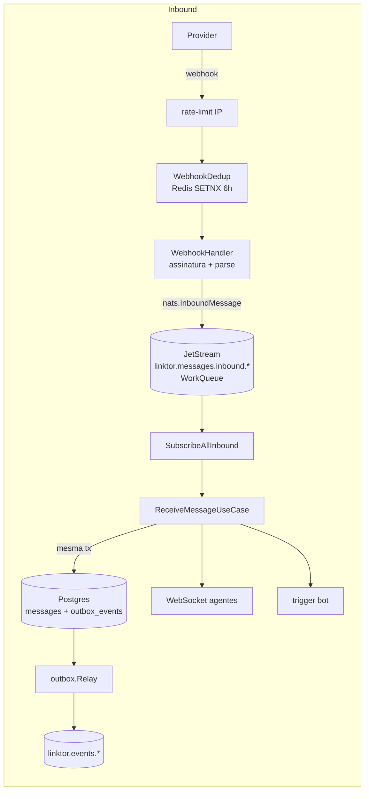
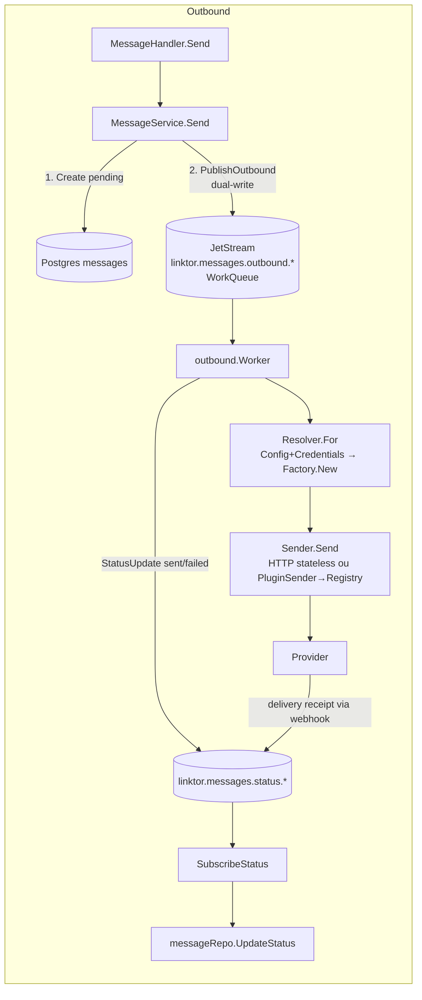

# Análise — Capacidade de Canal de Teste / Homologação por Tenant

- **Data:** 2026-07-23
- **Status:** Análise (nenhum código, migração ou ADR/RFC definitivo nesta rodada)
- **Escopo:** avaliar a introdução de canais de teste (loopback, espelho de provider, shadow) para homologação de integração por tenant, sem risco de tráfego sintético alcançar destinatários reais.
- **Método:** descoberta somente-leitura no código; toda afirmação cita arquivo e símbolo. Linhas são aproximadas (referência ao estado do repo em `feat/webchat-preview`, commit base `c0e8d8d`). Afirmações não verificáveis no repo estão marcadas como **[SUPOSIÇÃO]**.

**Nota de governança (verificação obrigatória do prompt):** não existem `CONSTITUTION.md`, ADRs, RFCs nem pacotes OpenSpec neste repositório (busca por nome em todo o repo; confirmado também por `BASELINE_VENDAX_LINKTOR.md:13`). As referências a ADR-010/ADR-012/OPENSPEC em `internal/integration/vendax/README.md` e `docs/vendax-integration/PLANO-integracao-linktor-vendax.md` pertencem à governança do **VendaX**, não do Linktor. Portanto **não há conflito documental que exija parada**; os invariantes vigentes vêm de `docs/auditoria-homologacao-2026-07.md`, `docs/plano-correcoes-homologacao.md`, `BASELINE_VENDAX_LINKTOR.md` e `execucao.md`, e estão incorporados abaixo.

---

## 1. Mapa arquitetural atual

### 1.1 Conceitos e onde vivem

| Conceito | Onde | Observação |
|---|---|---|
| Mensagem canônica | `entity.Message` — `internal/domain/entity/message.go:70` | `Content` é `string` livre + `Metadata map[string]string`; **não há payload tipado por `ContentType` nem versionamento de schema no envelope**. O único contrato versionado é o de webhooks de saída (`linktor-channel-v1`, `internal/infrastructure/webhook/envelope.go:24`). |
| Instância de canal | `entity.Channel` — `internal/domain/entity/channel.go:105` | `ID`, `TenantID`, `Type` (15 tipos, `:52-68`), `Config map[string]string`, `Credentials map[string]string` (`json:"-"`). **Não existe campo de ambiente.** |
| Identidade de conversa | `entity.Conversation` — `internal/domain/entity/conversation.go:50` | Chaveada por UUID interno, correlacionada por `(tenant_id, channel_id, contact_id)`. **Não depende do transporte** — o ID externo fica em `Message.ExternalID` e em `ContactIdentity.Identifier` (`contact.go:8`, unique tenant-scoped na migration `00007`). |
| Contrato de adapter (stateful) | `plugin.ChannelAdapter` — `pkg/plugin/adapter.go:8` | `Initialize/Connect/Disconnect/IsConnected/GetConnectionStatus/SendMessage/.../GetCapabilities`. Extensões opcionais: webhook, polling, WebSocket (`adapter.go:63-109`). |
| Contrato de envio (stateless) | `outbound.Sender` + `outbound.Factory` — `internal/outbound/sender.go:19-31` | Eixo separado do adapter por design (`internal/outbound/message.go:1-9`). |
| Registro/plug | `plugin.Registry` (`pkg/plugin/registry.go`) + `outbound.Resolver` (`internal/outbound/resolver.go:25`) | DI explícito em `cmd/server/main.go:396-412` (factories) e `:482-531` (adapters). Loader de plugin externo (hashicorp go-plugin, `pkg/plugin/loader.go`) existe mas **não é instanciado no boot**; stubs gRPC são manuais (`pkg/plugin/grpc.go:12`). |
| Capabilities | `plugin.ChannelCapabilities` — `pkg/plugin/types.go:104` | Estáticas, declaradas no `NewAdapter()` de cada canal. **Nenhum endpoint/serviço as expõe a consumidores** — o envio faz fallback (ex.: interactive→texto, `internal/outbound/worker.go:284`) em vez de negociar. |
| Outbox transacional | `entity.OutboxEvent` (`internal/domain/entity/outbox.go:12`) + relay (`internal/infrastructure/outbox/relay.go`) | **Somente no inbound**: `MessageRepository.CreateWithOutboxEvent` (`internal/infrastructure/database/message_repo.go:96`). O envio ao provider é **dual-write** (ver 1.3). |
| Credenciais | `channel.Credentials`/chaves sensíveis de `Config`, AES-256-GCM at-rest (`pkg/crypto/crypto.go:33`, `internal/infrastructure/database/channel_secrets.go`) | Sem tabela própria, **sem cofre (Vault/OpenBao — zero ocorrências)**, sem taxonomia produção/teste. |
| Conceito de ambiente | **Não existe** por canal | O que existe: `Server.Mode` debug/release/test (`internal/infrastructure/config/config.go:33`); allowlist de tipos habilitados por deployment via `LINKTOR_ENABLED_CHANNEL_TYPES` (`internal/application/service/channel.go:146-167`, `cmd/server/main.go:592`); sandbox restrito a pagamentos PagSeguro (`internal/whatsapp/payments/types.go:227`) e override de baseURL da Graph API (`pkg/graphapi/baseurl.go`, `internal/adapters/meta/client.go:58`). |
| Retenção/expurgo | **Não existe** para `messages`/`conversations`/`contacts` | Única retenção: `CleanupOldLogs` (30 dias, manual) para `message_logs` (`internal/application/service/observability.go:129`); MaxAge nos streams JetStream (`internal/infrastructure/nats/client.go:97-158`). Analytics lê **direto das tabelas operacionais** (`internal/infrastructure/database/analytics_repo.go:33-208`). |
| Observabilidade | Prometheus (`internal/infrastructure/metrics/metrics.go`, sem label de tenant por decisão de cardinalidade) + zap + `message_logs` (`entity.MessageLog`, `internal/domain/entity/observability.go:25`) | **Sem tracing distribuído (sem OTel) e sem correlation-id unificado**; log inbound não carrega `message_id`/`conversation_id` (`cmd/server/channel_log_meta.go:9`). Timeline de conversa é reconstruível pelos **dados** (Postgres), não pelos logs. |
| Testes | Mocks de repository + `MockProducer` em `pkg/testutil/`; E2E de webhook por handler (`internal/api/handlers/webhook_channels_e2e_test.go`); mock Prism da Graph API (`deploy/mocks/`, via `LINKTOR_GRAPH_API_URL`) | **Não existe fake reutilizável de adapter/Sender de canal** — só test doubles inline por pacote. |

### 1.2 Fluxo inbound (hoje)

1. Provider → `POST /webhooks/<provider>/:channelId` (`cmd/server/main.go:1054-1092`).
2. Middleware: rate-limit por IP + dedup Redis SETNX chave `webhook:dedup:global:<eventID>` TTL 6h (`internal/api/middleware/webhook_dedup.go:69-86`; eventID = header conhecido ou SHA-256 do corpo).
3. Handler valida assinatura por provider (WhatsApp HMAC-SHA256 `verifyWhatsAppSignature` `webhook.go:658`; Twilio HMAC-SHA1; Telegram token; etc.) e normaliza o payload em `nats.InboundMessage` (ex.: `processWhatsAppMessage` `webhook.go:861-1016`) — **não** em `entity.Message`.
4. `PublishInbound` → subject `linktor.messages.inbound.<type>` (stream `LINKTOR_MESSAGES`, **WorkQueuePolicy**, MsgID = id, janela de duplicatas 5 min — `producer.go:137`, `client.go:102-111`).
5. Consumer (`SubscribeAllInbound`, `main.go:827`) → `ReceiveMessageUseCase.Execute` (`internal/application/usecase/receive_message.go:61`): normaliza (`MessageNormalizer`), get/create contato e conversa, e **persiste mensagem + evento `message.received` na mesma transação** (`CreateWithOutboxEvent`, dedup autoritativo por unique parcial `(conversation_id, external_id)` — migration `00004`).
6. `outbox.Relay` (2s) publica os eventos com idempotency key (`internal/infrastructure/outbox/relay.go:54-87`).
7. Efeitos: broadcast WebSocket para agentes + trigger de bot (`main.go:863-865`). Erro transitório → NAK 5s fixo, MaxDeliver 5 → DLQ (`consumer.go:216-221`).

**Sem garantia de ordenação** (WorkQueue + `MaxAckPending:100`, sem particionamento por conversa).

### 1.3 Fluxo outbound (hoje)

1. `MessageHandler.Send` (`internal/api/handlers/message.go:112`) → `MessageService.Send` (`internal/application/service/message.go:103`).
2. Grava `entity.Message` `pending` no banco (`message.go:173`) e **publica direto no NATS** (`PublishOutbound`, `message.go:214`). **Dual-write, sem outbox**: queda do processo entre os dois passos deixa mensagem `pending` órfã, sem relay de recuperação.
3. `outbound.Worker.handle` (`internal/outbound/worker.go:108`) consome por channelType: `Resolver.For(channelID)` (cache 5 min) → merge `Config`+`Credentials` → `Factory.New` → rate-limit fixo 80 msg/s por canal (`main.go:416`, `worker.go:310`) → `sender.Send`.
4. Canais stateful (webchat, whatsapp não oficial) entram no mesmo worker via `PluginSenderFactory` → `plugin.Registry` (`internal/outbound/plugin_sender.go`).
5. Sucesso → `PublishStatusUpdate("sent")`; 4xx permanente → `failed` + ACK; 5xx/rate-limit → NAK 5s → DLQ (`worker.go:136-182`, `whatsapp_official/sender.go:76-88`).
6. Delivery receipts voltam como **webhook de status** → `linktor.messages.status.<type>` → `handleMessageStatusUpdate` → `messageRepo.UpdateStatus` (`main.go:1812-1864`). Sem guarda de monotonicidade de status e **sem reconciliação de "sent sem ACK"**.

Lacunas de comportamento relevantes ao tema (confirmadas no código):

- **Janela de 24h não é aplicada no fluxo ativo** — o enforcement existe em `whatsapp_official/consumer.go:233` (`SessionAwareConsumer.handleOutboundWithSession` → `IsSessionValid`), mas esse consumer **nunca é instanciado** fora do próprio pacote; o caminho real (`cloudSender.Send`, `whatsapp_official/sender.go:57`) envia free-form sem checagem.
- **Template reprovado não é bloqueado no envio** — o status sincroniza via webhook (`ProcessTemplateStatusWebhook`, `internal/application/service/template.go:412`), mas `sendTemplate` (`sender.go:146`) não consulta o status; a falha acontece só na Meta.

### 1.4 Diagramas

---

## 2. Lacunas por modalidade de canal de teste

Legenda de invasividade: **Baixa** = pacote novo + registro em `main.go`; **Média** = mudança de schema/entidade/serviço; **Alta** = mudança de topologia (streams, contrato público).

### 2.1 Loopback / mock (determinístico, executável em CI)

| Aspecto | Já existe | Falta |
|---|---|---|
| Envio sem provider | Padrão `Sender`/`Factory` mínimo pronto para copiar (`internal/adapters/direto/sender.go:22` — outbound-only, ~100 linhas); registro é 1 linha no `Resolver` (`main.go:396-407`) | Pacote `internal/adapters/loopback/` implementando `outbound.Factory`; constante `ChannelTypeLoopback` em `entity/channel.go:52` |
| Inbound sem provider | `GenericWebhook` com HMAC compartilhado (`internal/api/handlers/webhook.go:263`, payload `GenericWebhookPayload` `:2312`); canal WebChat entrega fim-a-fim in-process (`internal/adapters/webchat/adapter.go:139`) | Eco automático loopback (inbound sintético gerado a partir do outbound recebido) e script de conversa (ver §3.4) |
| Determinismo | Dedup por `ExternalID` no banco e MsgID no JetStream permitem replay idempotente | Controle de relógio/IDs para replay; perfil de falhas configurável (ver §3.3) |
| CI | Mock Prism da Graph API (`deploy/mocks/`) + `LINKTOR_GRAPH_API_URL`; testes E2E de webhook por handler já rodam em CI (`.github/workflows/ci.yml`) | Fake de `outbound.Sender` reutilizável em `pkg/testutil/` (hoje só há doubles inline) |

**Invasividade: Baixa** (sem o eixo de ambiente) a **Média** (com os invariantes do §3.2, que exigem coluna nova e guarda de envio). É a modalidade com melhor razão custo/valor — quase todos os primitivos existem.

### 2.2 Espelho do provider (número de teste Meta / sessão não oficial dedicada)

| Aspecto | Já existe | Falta |
|---|---|---|
| Canal WhatsApp Cloud com número de teste | Funciona hoje sem mudança: é uma instância `whatsapp_official` comum com credenciais do número de teste; `pkg/graphapi.BaseURL()` já permite apontar para mock/sandbox | Nada no caminho de envio. Falta o **rótulo de ambiente** e a validação de credencial (invariantes 1-3) — hoje nada impede misturar credencial de produção |
| Sessão não oficial dedicada | Sessão whatsmeow por canal já é o modelo (`storages/whatsapp_<channelID>.db`, `internal/application/service/channel.go:1044-1160`); QR/pair-code/reconexão prontos | Idem: rótulo de ambiente + allowlist de destinatários (a rede é a **real** — ver risco R1) |
| Validação de template/webhook reais | Registry de template com sync bidirecional Meta (`internal/application/service/template.go:341-421`); webhooks de status/template processados | Bloqueio de envio por status de template (o gap do §1.3 vale também aqui) |
| Allowlist de destinatários | **[SUPOSIÇÃO]** o número de teste da Meta só entrega a até 5 números verificados — proteção do lado do provider, não verificável no repo | Allowlist **do lado do Linktor** (invariante 1), obrigatória para a sessão não oficial, onde não há proteção nenhuma do provider |

**Invasividade: Média** — o transporte já funciona; o custo é inteiramente nos invariantes (ambiente, allowlist, credencial, marcação).

### 2.3 Shadow (produção com outbound suprimido e registrado)

| Aspecto | Já existe | Falta |
|---|---|---|
| Ponto de supressão | O funil único `Resolver.For` → `sender.Send` (`worker.go:120-136`) é o lugar natural para um decorator que registra em vez de enviar | O decorator em si (pequeno) — mas esse é o menor dos problemas |
| Tee do tráfego de produção | **Nada.** A stream de outbound é `WorkQueuePolicy` (`internal/infrastructure/nats/client.go:102`): cada mensagem é entregue a **um** consumidor e removida no ACK. Um segundo consumidor shadow **não pode** assinar a mesma stream | Mudança de topologia: retenção Interest/Limits ou republicação em subject `linktor.messages.shadow.*` — mexe no coração do delivery |
| Isolamento de status | `StatusUpdate` é chaveado por `message_id` e escreve em `messages.status` (`main.go:1812-1864`) | Resultados do shadow precisariam de armazenamento próprio para não sobrescrever o status real da mensagem |
| Comparação prod × shadow | **Nada**: sem correlation-id unificado, sem tracing (OTel ausente), log inbound sem `message_id` (`channel_log_meta.go:9`), sem ordenação por conversa | Infra de correlação inteira, pré-requisito para o shadow ter valor |

**Invasividade: Alta.**

**Decisão em aberto (respondida): shadow deve ficar para a fase 2.** O custo medido no código é dominado por três obstáculos estruturais — a semântica WorkQueue da stream de outbound, o pipeline de status compartilhado e a ausência de correlação/tracing — nenhum dos quais serve ao objetivo imediato (tenant homologando a **própria** integração). Shadow resolve um problema diferente (migração/homologação de **adapter** contra tráfego real) e só tem valor depois que existir correlation-id por mensagem. Loopback + espelho entregam a capacidade pedida por uma fração do custo.

---

## 3. Opções de desenho

### 3.1 Alternativa A — `Environment` como atributo de `Channel` (hipótese do prompt, corrigida)

Adicionar `Environment` (`sandbox | production`, default `production`, **imutável após a criação**) como campo de primeira classe em `entity.Channel` (`internal/domain/entity/channel.go:105`) e coluna em `channels`.

**Avaliação crítica da hipótese:** a metade "ambiente como atributo do ChannelInstance" está **certa** e é a mais barata dado o código real. A metade "**roteamento pelo par `(tenant, environment)`**" está **errada para este código**: não existe roteamento por `(tenant, tipo)` a corrigir — todo o roteamento já é por `channel_id` concreto (`Resolver.For(channelID)` `resolver.go:66`; conversa chaveada por `(tenant_id, channel_id, contact_id)`; subjects NATS por channelType mas payload carrega `ChannelID`). Ambiente **não precisa participar do roteamento**; ele é um atributo de **política** que os pontos de imposição consultam. Tratá-lo como chave de roteamento adicionaria complexidade sem contrapartida.

- **Impacto no contrato público (VendaX):** aditivo. O bridge VendaX endereça por tenant/canal (`internal/integration/vendax/channelconfig.go`, subjects `tenant.{id}.linktor.inbound` — `docs/vendax-integration/PLANO-integracao-linktor-vendax.md:50-54`); acrescentar `environment` ao envelope é backward-compatible. O `LinktorEnvelope` proposto ainda não tem o campo — precisa entrar **antes** do contrato congelar (pergunta em aberto Q4).
- **Migração de dados:** trivial — `ALTER TABLE channels ADD COLUMN environment ... DEFAULT 'production'`; backfill implícito. Atenção ao padrão de risco já apontado pela auditoria: colunas existem mas o repo não as persiste (ex.: `source`/`is_imported` em `message_repo.go:42-70`) — a coluna nova exige teste de round-trip no `channel_repo`.
- **Superfície de erro operacional:** pequena e concentrada — os pontos de imposição do §3.2. Erro típico: esquecer um caminho de envio novo fora do funil `Resolver`; mitigado porque **todos** os caminhos atuais (API, campanha, bot) convergem no worker.
- **Reversibilidade:** alta — coluna com default, campo aditivo no envelope, decorator removível.

### 3.2 Alternativa B — Tenant separado por ambiente

Um tenant `acme-sandbox` espelhando `acme`.

- **A favor:** isolamento máximo por construção — tudo já é tenant-scoped (unique de `contact_identities` por tenant, migration `00007`; limites por tenant, `entity/tenant.go:27`); zero mudança de schema.
- **Contra (medido no código):** duplica **tudo** que é chaveado por tenant: instâncias de canal e seus webhooks por `channelId` na URL (`main.go:1054-1092`), segredos de webhook, registry de templates (sync Meta por canal), config do bridge VendaX (subjects **por tenant** — o VendaX teria que assinar e configurar dois tenants), usuários/RBAC, contatos. "Promoção" vira re-provisionamento manual entre tenants — exatamente a divergência-fonte-de-bug que a hipótese do prompt teme, e ela está certa nisso. Agrava o risco R2: a auditoria 2026-07 encontrou IDOR de tenant; multiplicar tenants multiplica a superfície do bug que ainda está sendo corrigido.
- **Reversibilidade:** péssima — dados sintéticos ficam entranhados num tenant "real" que depois precisa ser excluído inteiro.

**Rejeitada como modelo principal.** (Continua útil como prática operacional pontual — nada impede um tenant de demonstração — mas não como o mecanismo da capacidade.)

### 3.3 Alternativa C — Sem eixo de ambiente: sandbox = tipos de canal dedicados

Só criar `ChannelTypeLoopback` (e usar WebChat/Prism/GenericWebhook, como a spec do Playground já orquestra — `documentos/LINKTOR-PLAYGROUND-SPEC.md`), sem atributo `environment`.

- **A favor:** custo mínimo; o Playground MVP declara explicitamente não precisar de feature nova no backend.
- **Contra:** não cobre a modalidade **espelho** (um canal `whatsapp_official` com número de teste é indistinguível de produção → invariantes 1, 2 e 3 insatisfeitos); marcação/retenção teria que ser inferida por tipo de canal, o que quebra no dia em que um tipo servir aos dois usos (o WebChat **já** é canal de produção para usuários finais — classificá-lo como "de teste" seria um erro).
- **Papel correto:** é o **subconjunto fase 0** da Alternativa A, não uma alternativa completa.

### 3.4 Recomendação

**Alternativa A**, implementada em duas ondas: (fase 0) adapter loopback + `environment` no schema + guarda de envio; (fase 1) allowlist/retensão/expurgo completos + espelho rotulado; (fase 2) shadow, condicionado à infra de correlação. Detalhe por invariante no §4.

### 3.5 Injeção de falha (avaliação)

Superfície proposta: perfil de falhas por canal sandbox, declarado em `channel.Config` (padrão já usado para `AdvancedSettings`, `entity/channel.go:253-341`) e mutável por endpoint admin (ex.: `POST /channels/:id/faults`), **interpretado exclusivamente dentro do adapter/sender loopback** — nunca como middleware no worker compartilhado. Assim o caminho de produção não ganha nenhum branch novo; a única guarda compartilhada é a do invariante 1.

| Falha | Ponto de injeção sem contaminar produção | Pré-requisito / observação |
|---|---|---|
| Queda e reconexão de sessão (não oficial) | Adapter loopback stateful implementando `plugin.ChannelAdapter` (`pkg/plugin/adapter.go:8`): `Disconnect()` forçado + `ConnectionStatus` transitando; o `pluginSender` já devolve erro transitório quando não há sessão viva (`plugin_sender.go:47-76`) → exercita NAK/redelivery de verdade | Nenhum. Comportamento real já existe no fluxo |
| Expiração da janela de 24h com pendência em outbox | Loopback rejeitando free-form "fora da janela" simulada | **Gap real:** o fluxo ativo não aplica janela de 24h (código órfão em `whatsapp_official/consumer.go:233`). Injetar essa falha hoje testaria um comportamento que a produção **não tem**. Corrigir o enforcement é pré-requisito para o cenário ter valor |
| Template reprovado/recategorizado em uso | Já injetável hoje: o webhook de template atualiza status (`ProcessTemplateStatusWebhook`, `template.go:412`) — basta uma rota de simulação que o invoque | **Mesmo gap:** o envio não consulta status de template (`sender.go:146`); o cenário só fica significativo com o bloqueio implementado |
| Mídia acima do limite do provider | Loopback devolvendo erro permanente estilo provider; note que `FetchMedia` já impõe teto próprio de 64 MiB (`internal/outbound/fetch.go:15-52`) e `Capabilities.MaxMediaSize` existe mas **não é aplicado** em lugar nenhum | Baixo custo |
| ACK perdido | Loopback confirma o POST (status "sent") e **nunca** emite o webhook de status — reproduz exatamente o gap real "sent sem reconciliação" (§1.3) | Nenhum. Cenário valioso: expõe lacuna existente |
| Mensagem duplicada em reconexão | Reenviar o mesmo `ExternalID` via `GenericWebhook` — exercita as três camadas reais de dedup (middleware Redis, unique parcial no banco, MsgID JetStream) | Cuidado: o dedup de middleware usa SHA-256 do corpo quando não há header (`webhook_dedup.go:59-66`) — o script precisa controlar se quer ou não ser deduplicado (ver §3.6) |
| Latência alta | `sleep` configurável no loopback antes do retorno; o `AckWait` de 60s e o abort por ctx do limiter (`worker.go:336`) são exercitados de verdade | Nenhum |
| Rate limit do provider | Loopback devolvendo erro classificado como transitório-rate-limit (espelhando `classifyError`, `whatsapp_official/sender.go:76-88`) → NAK 5s → MaxDeliver → DLQ | Expõe também a ausência de backoff exponencial (hoje NAK fixo 5s) |

### 3.6 Simulação de inbound (avaliação e ordem)

**(a) API de injeção + script versionável + replay determinístico — implementar primeiro.** A base existe: `GenericWebhook` (`webhook.go:263`) com HMAC e payload canônico simples; o Playground (repo separado, `documentos/LINKTOR-PLAYGROUND-SPEC.md`) já o especifica como superfície C3. Faltam três coisas para replay determinístico: (1) controle de `ExternalID`/timestamps pelo script (o payload já aceita `MessageID` — ok); (2) semântica explícita frente ao dedup de 6h por hash de corpo do middleware (`webhook_dedup.go`) — a rota de injeção sandbox deve ou escopar a chave de dedup por execução, ou exigir `X-Webhook-Id` único por passo do script; (3) formato de script de conversa (fora de escopo desta análise; candidato natural a RFC).

**(b) Cliente de chat no console respeitando janela de 24h e capabilities — depois.** Depende de dois mecanismos que **não existem**: endpoint de descoberta de capabilities (hoje estáticas e internas, `pkg/plugin/types.go:104`, sem exposição em `internal/api`) e enforcement real da janela de 24h (§1.3). Construir (b) antes disso simularia regras que o backend não aplica — o pior tipo de ferramenta de homologação. Nota: o simulador WebChat do Playground (C2) já cobre parte do valor de (b) sem custo no backend.

---

## 4. Matriz de invariantes × ponto de imposição

| # | Invariante | Viabilidade | Ponto de imposição e por quê |
|---|---|---|---|
| 1 | Sandbox só entrega a allowlist explícita do tenant; violação falha ruidosamente | **Viável.** | **Autoritativo:** decorator de `outbound.Sender` aplicado em `Resolver.For` (`internal/outbound/resolver.go:94`) quando `channel.Environment == sandbox` — o canal acabou de ser carregado ali, e **todos** os caminhos de envio (API, campanha, bot, retries) convergem nesse funil; impor no handler HTTP deixaria campanhas/bots descobertos. **Fail noisy:** devolver `PermanentError` → `StatusUpdate failed` + `message_logs` via `channelActivityLogger` (`cmd/server/channel_activity_logger.go:19`) + métrica dedicada. **Fail-fast complementar** (UX): validação em `MessageService.Send` (`message.go:103`) para erro síncrono na API. Armazenamento da allowlist: decisão em aberto Q1. |
| 2 | Credencial de produção ≠ canal sandbox, validado na criação | **Parcialmente viável — exige honestidade sobre o limite.** Não existe taxonomia de credencial (elas vivem em `channel.Credentials`/`Config` cifrados, sem origem declarada — `channel_secrets.go`); **não é possível inferir do token se ele é "de produção"**. | Imposição por construção em `ChannelService.Create`/`Update` (`internal/application/service/channel.go:185`, `:302-333`): (a) `Environment` imutável após criação (rejeitar update); (b) campo declarativo obrigatório na credencial do canal sandbox (ex.: `credential_environment=sandbox`) validado no create; (c) para Meta, checagem opcional do `phone_number_id` contra lista declarada de números de teste do tenant — **[SUPOSIÇÃO]** não há como validar junto à Meta sem chamada à Graph API. A garantia dura continua sendo o invariante 1 (allowlist), que segura mesmo credencial errada. |
| 3 | Marcação imutável no envelope, propagada até a persistência | **Viável, com armadilha conhecida.** | Origem única: `Environment` do canal (imutável ⇒ marcação imutável por derivação). Propagação: campo `environment` em `nats.InboundMessage`/`OutboundMessage`/`Event` (`internal/infrastructure/nats/producer.go:44-101`) e no envelope de webhook `linktor-channel-v1` (`internal/infrastructure/webhook/envelope.go:55`). Persistência: denormalizar em `conversations.environment` no `getOrCreateConversation` (`receive_message.go:285`) — conversa nasce presa a um canal e o join `messages→conversations→channels` torna o expurgo e o bloqueio de export indexáveis sem tocar a tabela `messages`. **Armadilha:** o padrão "coluna existe mas o repo não grava" já aconteceu (`source`/`is_imported`, `message_repo.go:42-70`) — exigir teste de integração de round-trip. |
| 4 | Retenção curta + expurgo automático + bloqueio de export analítico (LGPD) | **Viável, mas parte do zero.** Não existe purge de dados de mensagem no repo; o único precedente é `CleanupOldLogs` (manual, `observability.go:129`). | (a) Job agendado novo (não existe scheduler; precedente mais próximo é o relay com tick de 2s, `main.go:893`) deletando conversas/mensagens de canais sandbox por idade — o `ON DELETE CASCADE` de `messages`→`conversations` (`postgres.go:334`) faz o trabalho pesado. (b) Bloqueio de export: **na fonte** — filtros `WHERE environment != 'sandbox'` nas queries de `analytics_repo.go:33-208` (analytics lê as tabelas operacionais diretamente; não há ETL a interceptar) e skip no bridge VendaX (`internal/integration/vendax/outbound.go`). (c) Streams NATS já expiram sozinhas (MaxAge, `client.go:97-158`). |
| 5 | Promoção sandbox→produção é troca de configuração no consumidor | **Viável e quase gratuito por acidente feliz da arquitetura.** | Promoção = criar canal `production` novo e apontar o consumidor para o novo `channel_id` (ou, no VendaX, o bridge de channelconfig — `channelconfig.go`). Como conversa é chaveada por `channel_id`, o histórico sandbox **não migra** — comportamento desejado (ele será expurgado pelo invariante 4). Nenhuma mudança de código no consumidor: o contrato (envelope, subjects) é idêntico entre ambientes por construção da Alternativa A. Ponto de atenção: o campo `environment` precisa entrar no contrato VendaX **antes** do freeze (Q4). |

**Requisito de segurança (modo de falha inaceitável):** a defesa é em camadas — (i) allowlist no funil único de envio (invariante 1, cobre todos os produtores de outbound); (ii) imutabilidade de `Environment` + validação de credencial no create (invariante 2, reduz a chance de o canal sandbox sequer alcançar rede real); (iii) para espelho não oficial, a allowlist é a **única** barreira real — destacado no risco R1.

---

## 5. Riscos

| # | Risco | Mitigável no desenho? |
|---|---|---|
| R1 | **Espelho não oficial roda na rede real do WhatsApp**: tráfego sintético de homologação por sessão whatsmeow pode causar banimento do número (política Meta) e, se a allowlist falhar, alcança pessoas reais. | **Parcial.** Allowlist mitiga o alcance; o risco de ban do número de teste é inerente à modalidade e **não é mitigável no desenho** — só documentável (número dedicado, descartável). |
| R2 | **Isolamento de tenant ainda em correção**: a auditoria 2026-07 (`docs/auditoria-homologacao-2026-07.md`) encontrou IDOR de tenant (P0). Toda a garantia de sandbox herda o isolamento de tenant; enquanto o P0 não fechar, o invariante 1 pode ser contornado por baixo. | **Não, por este desenho** — é pré-condição externa (workstream do `docs/plano-correcoes-homologacao.md`). |
| R3 | **Dual-write no envio** (`MessageService.Send`, §1.3): mensagem pode ficar `pending` órfã. Em sandbox é só ruído de homologação; mas o canal de teste vai **expor** esse comportamento ao tenant como se fosse bug dele. | Não neste escopo; registrar como limitação conhecida (candidato a estender o outbox transacional ao envio — fora de escopo). |
| R4 | **Padrão de divergência entidade↔schema** (colunas não persistidas pelo repo; precedente em `message_repo.go`): a marcação do invariante 3 pode silenciosamente não ser gravada. | **Sim** — teste de integração de round-trip obrigatório no pacote OpenSpec correspondente. |
| R5 | **Cenários de falha sem contrapartida real** (janela 24h e template reprovado não são aplicados no fluxo ativo): a injeção de falha simularia comportamento inexistente, dando ao tenant falsa confiança. | **Sim** — sequenciar: implementar o enforcement antes (ou junto) dos cenários correspondentes de injeção. |
| R6 | **Bloqueio de export analítico é por filtro, não por barreira física** (analytics lê tabelas operacionais): toda query nova é um vazamento em potencial de dado sandbox. | **Parcial** — mitigável por convenção + teste; barreira física (schema/tabela separada) foi descartada pelo custo. Revisar se o volume de sandbox justificar. |
| R7 | Métricas Prometheus não têm label de tenant por decisão deliberada de cardinalidade (`metrics.go:6-8`); observabilidade de sandbox por tenant dependerá de `message_logs`, cujo inbound hoje nem carrega `message_id`. | **Parcial** — enriquecer `inboundLogMeta` é barato; label de tenant em métrica continua vetado (decisão existente, correta). |

---

## 6. Decomposição sugerida (ADR / RFC / OpenSpec)

O Linktor não tem estrutura de governança própria (ver nota inicial) — esta seria a primeira leva. Esforço relativo: P (dias) / M (semana±) / G (multi-semana).

| Item | Conteúdo | Depende de | Esforço |
|---|---|---|---|
| **ADR-L001** — Ambiente como atributo de `Channel` | Decisão da Alternativa A: campo/coluna `environment`, imutabilidade, default `production`, propagação nos envelopes NATS e `linktor-channel-v1`, denormalização em `conversations` | — | P |
| **ADR-L002** — Guarda de entrega sandbox | Decisão do ponto único de imposição (decorator no `Resolver`), semântica de falha ruidosa, validação de credencial no create, imutabilidade | ADR-L001 | P |
| **ADR-L003** — Retenção e não-exportação de dado sandbox | Prazo de retenção (Q3), job de expurgo, filtros de analytics e bridge VendaX, posição LGPD | ADR-L001 | P |
| **RFC-L001** — Adapter loopback + perfil de injeção de falha | Contrato do adapter (`Sender` + `ChannelAdapter` stateful p/ sessão), formato do perfil de falhas em `Config`, endpoint admin, tabela do §3.5 | ADR-L001/L002 | M |
| **RFC-L002** — API de simulação inbound + scripts de conversa com replay | Extensão do `GenericWebhook` ou rota dedicada sandbox, formato de script versionável, semântica de dedup no replay (§3.6a) | ADR-L001; parcialmente RFC-L001 | M |
| **RFC-L003** — Shadow channel *(fase 2)* | Tee da stream outbound (mudança de retention/republicação), armazenamento próprio de resultado, correlação prod×shadow | Correlation-id/observabilidade por mensagem (trabalho novo, fora deste escopo) + RFC-L001 | G |
| **OpenSpec `sandbox-core`** | Implementa ADR-L001 + ADR-L002 (schema, entidade, repos com teste round-trip — R4, guarda, validação de create) | ADRs L001/L002 aceitos | M |
| **OpenSpec `loopback-adapter`** | Implementa RFC-L001; inclui fake reutilizável de `Sender` em `pkg/testutil/` | `sandbox-core` | M |
| **OpenSpec `inbound-sim`** | Implementa RFC-L002 | `sandbox-core`; usa `loopback-adapter` | M |
| **OpenSpec `sandbox-retention`** | Implementa ADR-L003 (job de expurgo + filtros de export) | `sandbox-core` | P–M |
| *(pré-requisito paralelo)* enforcement de janela 24h + bloqueio de template reprovado no envio | Corrige os gaps do §1.3 para que os cenários de falha correspondentes tenham contrapartida real (R5) | independente; sequenciar antes dos cenários em RFC-L001 | M |

Ordem crítica: **ADR-L001 → ADR-L002 → `sandbox-core` → `loopback-adapter` → `inbound-sim`**, com `sandbox-retention` em paralelo após `sandbox-core`. Shadow (RFC-L003) só entra quando houver correlação por mensagem.

---

## 7. Perguntas em aberto (decisão humana)

1. **Escopo da allowlist** (invariante 1): por canal sandbox ou por tenant? Recomendação preliminar: por tenant, com opt-in por canal — mas é decisão de produto.
2. **RBAC da allowlist**: quem pode editar (admin do tenant? só operador Linktor?), e a edição entra na trilha de auditoria (`internal/application/service/audit.go`)?
3. **Prazo de retenção sandbox** (invariante 4): 7 dias? 30? Precisa de posição LGPD/negócio.
4. **Contrato VendaX**: o campo `environment` entra no `LinktorEnvelope` agora, antes do freeze do plano de integração (`docs/vendax-integration/PLANO-integracao-linktor-vendax.md:50-54`)? Exige coordenação com a governança do VendaX (ADR-012 deles).
5. **Espelho não oficial**: dado o risco R1 (ban, rede real), a modalidade entra no lançamento ou fica atrás de flag/termo de aceite?
6. **Playground como cliente oficial**: o app Tauri (`linktor-playground`, repo separado) assume o papel da superfície (b) do §3.6, ou o console admin web ganha o cliente de chat próprio?
7. **Shadow**: confirma o adiamento para fase 2 (recomendado no §2.3), ou há demanda concreta de migração de adapter que o antecipe?
8. **Pré-requisitos de comportamento** (janela 24h, bloqueio de template reprovado): entram neste programa ou no workstream de correções da homologação (`docs/plano-correcoes-homologacao.md`)?

---

## Resumo executivo

O Linktor já tem os alicerces certos para canal de teste: roteamento de envio por instância de canal num funil único (`Resolver` → `Sender`), outbox transacional no inbound com dedup em três camadas, um padrão de sender mínimo pronto para copiar (`direto`), webhook genérico com HMAC para injeção de inbound, mock Prism da Graph API e a spec do Playground orquestrando tudo isso.
O que **não** existe: qualquer conceito de ambiente por canal, allowlist de destinatários, taxonomia de credencial, marcação de origem sintética, retenção/expurgo de mensagens, tracing/correlação por mensagem, e governança formal (sem CONSTITUTION/ADR/RFC/OpenSpec — não há conflito documental, mas a decomposição parte do zero).
A hipótese `environment: sandbox|production` como atributo do `ChannelInstance` está **certa na essência e errada no detalhe**: ambiente deve ser atributo de política do canal, mas **não** chave de roteamento — o código já roteia por `channel_id` e nada precisa mudar nisso. Tenant separado por ambiente foi rejeitado com evidência: duplicaria webhooks, credenciais, templates e a config do bridge VendaX, e ampliaria a superfície do IDOR de tenant ainda em correção.
Recomendação: **Alternativa A em duas ondas** — (fase 0) coluna `environment` + guarda de envio como decorator no `Resolver` (falha ruidosa via `StatusUpdate`+`message_logs`) + adapter loopback; (fase 1) allowlist por tenant, validação de credencial no create com `Environment` imutável, propagação da marcação nos envelopes NATS e denormalização em `conversations`, job de expurgo e filtros de export no analytics/bridge VendaX; (fase 2) **shadow adiado** — a stream outbound é WorkQueue (sem segundo consumidor), o pipeline de status é compartilhado e não há correlação por mensagem; o custo real é alto e o valor imediato, baixo.
Riscos não mitigáveis no desenho: ban de número no espelho não oficial (inerente à rede real) e a pré-condição do isolamento de tenant (P0 da auditoria 2026-07). Dois gaps de comportamento — janela de 24h e bloqueio de template reprovado existem no código mas **não operam no fluxo ativo** — devem ser corrigidos antes dos cenários de injeção de falha correspondentes, sob pena de homologar contra regras que a produção não aplica.
Próximo passo sugerido: aceitar/ajustar ADR-L001 e ADR-L002 e responder as perguntas Q1–Q4.
